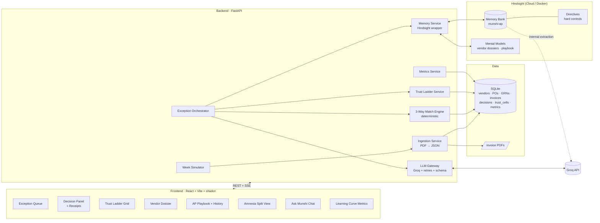
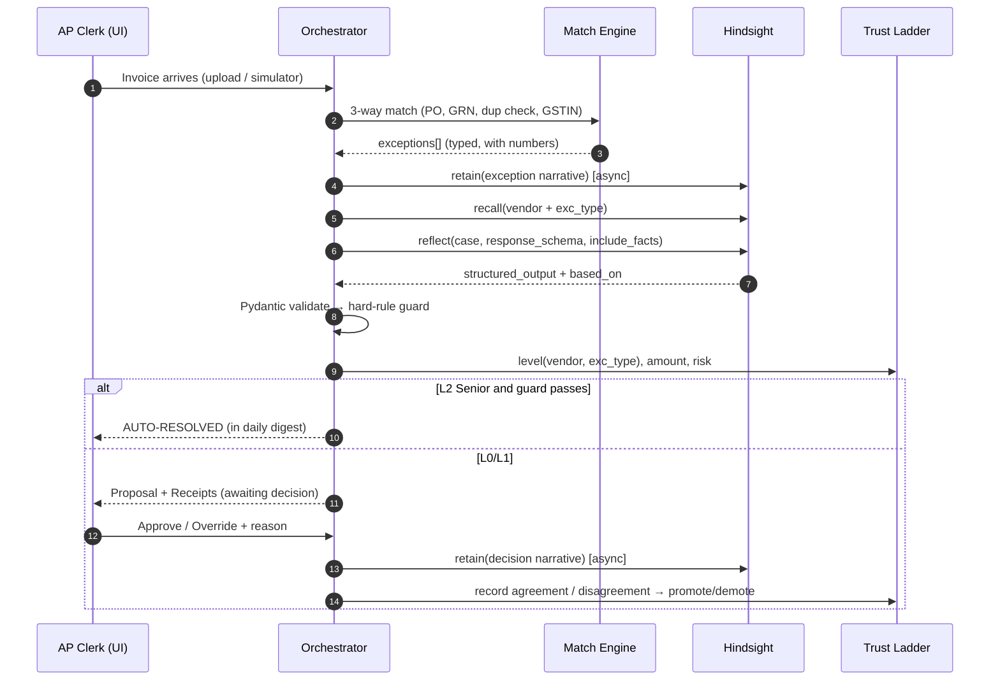

# Munshi — The AP Clerk Who Never Forgets

> **HackwithHyderabad 3.0 · Track: AI Agents That Learn Using Hindsight**
> An Accounts Payable exception-handling agent that learns your finance team's unwritten rules from every decision, earns autonomy one vendor at a time, and cites evidence ("receipts") for every call it makes.

*"Munshi" is the traditional Hindustani word for the clerk and bookkeeper who kept a merchant's accounts and remembered every deal. That is exactly what this agent is.*

---

## 0. TL;DR (read this if nothing else)

| | |
|---|---|
| **Problem** | AP teams process thousands of invoices. 10–25% hit exceptions (price mismatch, partial delivery, duplicate, GST mismatch, bank-change requests). The fix is usually tribal knowledge in a senior clerk's head: *"Deccan Steel is always ~2% over because of the steel index. Approve it."* When that clerk is on leave, work stops. When they quit, the knowledge is gone. |
| **Solution** | **Munshi** triages each exception invoice. It uses **Hindsight** to recall how similar cases for the same vendor were resolved before, proposes a decision with cited precedents, and learns from every human approve/override. |
| **USP** | **Earned Autonomy + Receipts + Fraud Memory** (see §2). Munshi starts as an intern that only suggests. It gets *promoted* per vendor and per exception type once its suggestions keep matching the humans. Every decision shows the exact memories behind it. Because it remembers what "normal" looks like for each vendor, it catches bank-detail fraud that rules miss. |
| **Demo hook** | An **Amnesia toggle** processes the same invoice with and without memory, side by side. A **learning curve** chart climbs as simulated weeks pass. The **AP Playbook** rewrites itself live (Hindsight mental model version history). |
| **Stack** | FastAPI (Python 3.11) · Hindsight (Cloud, with local Docker fallback) · Groq (`openai/gpt-oss-120b` for the agent, `openai/gpt-oss-20b` inside Hindsight) · SQLite for the ERP data · React + Vite + Tailwind + shadcn/ui · Recharts |

---

## 1. The Problem (the story we tell the judges)

**Persona: Priya, AP Lead at "Charminar Foods Pvt Ltd"**, a mid-size Hyderabad FMCG manufacturer with about 180 active vendors and about 2,500 invoices a month.

- Every morning Priya's team gets an **exception queue**: invoices that failed the 3-way match (PO ↔ Goods Receipt ↔ Invoice).
- About 70% of those exceptions are *recurring patterns* that a senior person resolves in seconds from memory:
  - *"Sri Lakshmi Packaging always adds ₹1,200 freight that isn't on the PO. Approved per the 2024 agreement."*
  - *"Nimbus Cloud re-sends the same invoice when payment is late. It's a duplicate, reject it."*
  - *"Deccan Steel's price floats with the steel index. Anything within 3% is fine."*
  - *"Apex Logistics never changes bank accounts. Last time someone asked, it was fraud."*
- The knowledge lives in **people, not systems**. ERP rules can't capture it because it is fuzzy, vendor-specific, and keeps changing.
- **Real pain for Indian companies:** MSME vendors must be paid within 45 days (Income-tax Act §43B(h)) or the expense deduction is lost. So exceptions sitting in the queue cost real tax money. Business Email Compromise (fake "our bank details changed" emails) is among the most expensive frauds hitting finance teams worldwide.

**Would someone pay $50/month?** An AP clerk in India costs ₹25–40k/month. If Munshi auto-resolves even half the recurring exceptions and blocks one fraudulent payment a year, it pays for itself many times over.

---

## 2. Unique Selling Point: three ideas that reinforce each other

### USP 1: Earned Autonomy ("the agent gets promoted")
Most AI agents are either fully manual (a chatbot) or fully automatic (scary for finance). Munshi uses a **trust ladder**, tracked **per (vendor, exception type)**:

| Level | Name | Behaviour | Promotion rule |
|---|---|---|---|
| L0 | **Intern** | Only proposes. A human must decide. | Default for anything new |
| L1 | **Associate** | Proposes and pre-fills the decision. One-click accept. | ≥ 3 human decisions in this cell, ≥ 80% agreement |
| L2 | **Senior** | **Auto-resolves** below an amount threshold, and humans get a daily digest. | ≥ 6 decisions, ≥ 90% agreement, no overrides in the last 3 |
| ⛔ | **Demoted** | Drops back to L0 immediately after any override on a high-risk case | Automatic |

The ladder is shown as a live grid in the UI. **Judges watch cells turn green as the agent learns.** It is the most visual possible proof that *memory = improvement*. Hard safety limits (Hindsight **directives**) sit *above* the ladder, and no autonomy level can bypass them.

### USP 2: Receipts ("every decision cites its memories")
Every proposal shows: *"I recommend APPROVE because:"* followed by clickable precedent cards, e.g. `[12 Aug · INV-SLP-0412 · Priya approved ₹1,200 freight · "per 2024 freight agreement"]`. These come straight from Hindsight `reflect(... include_facts=True)` → `based_on.memories`. For finance, this is non-negotiable: **auditors need to know why**. It also makes Hindsight's role unmistakable to the judges.

### USP 3: Fraud Memory ("it knows what normal looks like")
Because Munshi remembers every vendor's history (bank account, invoice cadence, typical amounts, email domain, the people who contact us), it flags anomalies no static rule would catch:
- *"Apex Logistics is asking to change its bank account. In 14 months they have never done so. The request came from `apex-logistics.co` (usually `apexlogistics.in`). The last bank-change request in this bank, for Deccan Steel in March, was confirmed fraud."*

This demo moment makes judges lean forward.

**One-line pitch:** *"Munshi learns the unwritten rules of your AP desk from every correction, earns the right to act on its own one vendor at a time, and can always show you why."*

---

## 3. Scope: one workflow, done brilliantly

**In scope (MVP, must work flawlessly):**
1. Ingest invoices (synthetic PDFs + a JSON sidecar) → 3-way match against POs and GRNs in SQLite.
2. Detect exceptions deterministically, in Python rather than the LLM (see §6.2).
3. For each exception: Hindsight recall + reflect → structured proposal with citations.
4. Human review UI: Approve / Reject / Hold / Override, with a free-text reason → **retained to Hindsight**.
5. Trust ladder (earned autonomy) plus auto-resolution for L2 cells.
6. Vendor dossier (Hindsight mental model per vendor).
7. The AP Playbook (a global mental model) with version history.
8. Amnesia toggle (memory on or off, side by side).
9. A "Simulate next week" button that replays pre-generated weekly invoice batches, so the learning curve shows in 3 minutes.
10. "Ask Munshi": free-form Q&A over AP memory (`reflect`), e.g. *"Why do we pay Deccan Steel above PO?"*

**Stretch (only if MVP is done and demo-rehearsed):**
- Email inbox ingestion (vendor emails as retained context).
- MSME 45-day SLA radar with ₹ at risk.
- Export an audit pack (PDF) with decision plus evidence.

**Explicitly out of scope:** real ERP integration, OCR of scanned images, actual payments, auth/multi-tenant. Mention these in the pitch as the "path to adoption".

---

## 4. System Architecture



### 4.1 The key design decision: what goes where
This separation makes the system **robust**. Judges who ask "why not just put everything in a vector DB?" get a crisp answer:

| Concern | Lives in | Why |
|---|---|---|
| Invoices, POs, GRNs, amounts, dates | **SQLite** | Facts that must be *exact*. Money math never goes through an LLM. |
| Exception detection (price/qty variance, duplicates, GSTIN mismatch) | **Python rules** | Deterministic, testable, instant, free. |
| *How* exceptions were resolved, *why*, vendor quirks, agreements, fraud history, human corrections | **Hindsight** | Fuzzy, contextual, evolving knowledge. This is what Hindsight's retain → observation consolidation → mental models pipeline is built for. |
| Judgment ("given all this, what should we do?") | **Hindsight `reflect`** with `response_schema` | Agentic reasoning over memory, bounded by directives and disposition. Returns structured JSON plus evidence. |
| Autonomy level, agreement stats | **SQLite** (`trust_cells`) | Must be exact and auditable. |

---

## 5. Hindsight Memory Design (the heart: 25% of the score)

All method names and parameters below were checked against the official Python client source (`hindsight-clients/python/hindsight_client/hindsight_client.py`).

### 5.1 Bank setup (one-time, `scripts/setup_bank.py`)

```python
from hindsight_client import Hindsight
hs = Hindsight(base_url=HINDSIGHT_URL, api_key=HINDSIGHT_API_KEY, timeout=60.0)

hs.create_bank(
    bank_id="munshi-ap",
    name="Munshi – Charminar Foods AP Desk",
    mission=(
        "You are the institutional memory of an Accounts Payable team at an Indian "
        "FMCG manufacturer. You remember how every invoice exception was resolved, "
        "by whom and why; vendor-specific agreements and quirks; and every fraud "
        "attempt. You reason like a careful senior AP accountant: precedent first, "
        "money safety always."
    ),
    retain_mission=(
        "Extract: vendor names, exception types, amounts and variance %, the decision "
        "taken, the stated reason, who decided, agreements referenced, bank account "
        "details and changes, email domains, and whether an outcome was later "
        "confirmed correct or wrong."
    ),
    observations_mission=(
        "Consolidate recurring patterns per vendor and per exception type, e.g. "
        "'Vendor X price variance under 3% is routinely approved due to index pricing'."
    ),
    disposition={"skepticism": 5, "literalism": 4, "empathy": 2},
    enable_observations=True,
)
```

**Disposition rationale:** skepticism 5 because AP is adversarial (fraud, overbilling). Literalism 4 because contracts and amounts matter. Empathy 2 because we are polite to vendors, but a sob story doesn't move money.

### 5.2 Directives: hard controls that no memory can override

```python
DIRECTIVES = [
  ("bank-change-verification", 100,
   "Never recommend paying to a bank account that differs from the vendor's last "
   "verified account. Always recommend HOLD and a call-back verification."),
  ("duplicate-block", 90,
   "Never recommend approving an invoice whose number, vendor and amount match an "
   "already-paid invoice."),
  ("high-value-escalation", 80,
   "Any invoice above INR 5,00,000 must be recommended for ESCALATE to the Finance "
   "Controller regardless of precedent."),
  ("cite-evidence", 50,
   "Every recommendation must reference the specific past decisions it relies on. "
   "If no relevant precedent exists, say so and lower confidence."),
]
for name, prio, content in DIRECTIVES:
    hs.create_directive(bank_id="munshi-ap", name=name, content=content, priority=prio)
```

The trust ladder also enforces the first three in Python code. **Defence in depth:** the LLM is told the rules, *and* the code refuses to auto-resolve if one would be violated.

### 5.3 What we retain (every event becomes memory)

| Event | `context` | `tags` | `document_id` | Memory type |
|---|---|---|---|---|
| Invoice exception detected | `"AP system: invoice exception detected"` | `vendor:<id>`, `exc:<type>` | `inv-<id>` | world |
| **Human decision + reason** (the gold) | `"Decision by <name>, <role>"` | `vendor:<id>`, `exc:<type>`, `decision` | `dec-<id>` | experience/world |
| Agent's own proposal | `"Munshi proposal"` | `vendor:<id>`, `exc:<type>`, `proposal` | `prop-<id>` | experience |
| Human **override** of the agent | `"Correction by <name>: agent was wrong"` | `vendor:<id>`, `exc:<type>`, `correction` | `dec-<id>` | world |
| Vendor email / agreement note | `"Email from vendor <domain>"` | `vendor:<id>`, `comms` | `mail-<id>` | world |
| Bank-change request | `"Bank detail change request"` | `vendor:<id>`, `bank`, `risk` | `bank-<id>` | world |
| Later outcome ("that hold was right, it was fraud") | `"Outcome confirmation"` | `vendor:<id>`, `outcome` | `out-<id>` | world |

Every item carries `timestamp=` (the simulated business date, so temporal recall like *"last quarter"* works) and `metadata={"invoice_id":..., "amount_inr":..., "decision":...}`. Because `document_id` gives idempotent upserts, re-running the simulator never duplicates memory.

**Content is written as a natural-language narrative, not raw JSON**, because Hindsight's LLM extraction works best on prose:
```text
On 12 Aug 2026, invoice INV-SLP-0412 from Sri Lakshmi Packaging (₹48,200) included
a freight charge of ₹1,200 not present on PO-7731. Priya Reddy (AP Lead) APPROVED it.
Reason: "Freight is billed separately per our 2024 packaging agreement."
```

**Retain strategy:** decisions use `retain_async=True` so the UI stays snappy. We track `operation_id` and show a small "🧠 memorised" toast when it lands. Bulk seeding uses `retain_batch(..., retain_async=True)`.

### 5.4 How we recall and reason for each exception

```python
# Step 1 – targeted evidence (fast, shown as "Receipts")
evidence = hs.recall(
    bank_id="munshi-ap",
    query=f"How were {exc_type} exceptions from {vendor_name} resolved, and why?",
    tags=[f"vendor:{vendor_id}", f"exc:{exc_type}"],
    tags_match="any",          # vendor OR exception-type memories, plus untagged policy
    types=["observation", "world", "experience"],
    budget="mid",
    max_tokens=3000,
    query_timestamp=business_date_iso,
)

# Step 2 – agentic judgment with structured output + citations
result = hs.reflect(
    bank_id="munshi-ap",
    query=build_case_prompt(invoice, po, grn, exception, evidence),
    context="AP exception triage: propose a decision",
    budget="mid",
    response_schema=DECISION_SCHEMA,
    include_facts=True,         # → result.based_on.memories  = our "Receipts"
    tags=[f"vendor:{vendor_id}"],
    tags_match="any",
)
proposal = result.structured_output      # validated by Pydantic afterwards
receipts = result.based_on               # memories + mental models + directives used
```

`DECISION_SCHEMA`:
```json
{
  "type": "object",
  "properties": {
    "action": {"type": "string", "enum": ["APPROVE", "REJECT", "HOLD", "ESCALATE", "APPROVE_PARTIAL"]},
    "approved_amount_inr": {"type": "number"},
    "confidence": {"type": "number", "minimum": 0, "maximum": 1},
    "rationale": {"type": "string"},
    "precedents_used": {"type": "array", "items": {"type": "string"}},
    "risk_flags": {"type": "array", "items": {"type": "string"}},
    "novel_case": {"type": "boolean"}
  },
  "required": ["action", "confidence", "rationale", "novel_case"]
}
```

### 5.5 Mental models: the knowledge the agent "grows"

| Mental model | `source_query` | `tags` | Trigger |
|---|---|---|---|
| **Vendor Dossier** (one per vendor) | "Summarise everything we know about how to handle invoices from {vendor}: agreements, recurring exceptions and how we resolve them, bank details history, risk signals." | `[vendor:<id>]` | `refresh_after_consolidation: True, mode: "delta"` |
| **AP Playbook** (global) | "What are the unwritten rules this AP team follows when resolving invoice exceptions? Group by exception type, cite vendors." | none | `refresh_after_consolidation: True, mode: "delta"` |
| **Fraud Watchlist** | "Which vendors or patterns have been associated with suspected or confirmed fraud, and what signals preceded it?" | `[risk]` (`tags_match: "any"`) | `refresh_after_consolidation: True` |

- `mode: "delta"` preserves unchanged sections byte-for-byte, so the playbook grows instead of being rewritten each time.
- **Demo gold:** `get_mental_model_history()` feeds a **"Playbook timeline"** slider in the UI. Week 1: empty. Week 4: three rules. Week 12: a complete desk manual nobody wrote.
- Reflect automatically prioritises mental models → observations → raw facts, so answers get *faster and more consistent* as models mature.

### 5.6 The Amnesia toggle (before/after proof)
The **same** invoice goes through two pipelines side by side:
- **Left, "Generic AI":** Groq LLM only. It gets the invoice/PO/GRN plus the directives as plain text, but **no Hindsight**. Typical output: *"Price variance 2.4%. Recommend HOLD and contact vendor."* (generic, safe, useless)
- **Right, "Munshi":** the full Hindsight pipeline. Typical output: *"APPROVE. Deccan Steel variance under 3% has been approved 7/7 times since May due to steel-index pricing (Priya, Ravi). Confidence 0.93."* plus receipts.

---

## 6. The Agent Pipeline (deterministic orchestration, LLM only for judgment)

> The brief warns: *"make sure to have your agent ready to handle function calling errors."* So we **don't** rely on a free-form tool-calling loop for the core flow. The orchestrator is plain Python. The LLM (via Hindsight reflect) is called at exactly one point with a JSON schema, then validated and retried. This is the single biggest reliability decision in the plan.



### 6.1 Exception taxonomy (deterministic detectors)
| Code | Detector | Example vendor personality |
|---|---|---|
| `PRICE_VAR` | unit price differs from PO by more than 0.5% | Deccan Steel (index pricing, variance up to 3% is OK) |
| `QTY_VAR` | invoiced qty > GRN received qty | Godavari Agro (partial deliveries, approve for received qty) |
| `UNPO_CHARGE` | line item not on PO (freight, packing) | Sri Lakshmi Packaging (₹1,200 freight is OK) |
| `DUPLICATE` | same vendor + invoice no., or same amount within 30 days (fuzzy) | Nimbus Cloud (re-sends invoices, so reject) |
| `GSTIN_MISMATCH` | GSTIN on invoice ≠ vendor master | Hyderabad Chemicals (new branch GSTIN, needs master update) |
| `TAX_CALC` | GST amount ≠ rate × taxable value | Various (rounding under ₹1 is OK) |
| `BANK_CHANGE` | bank details ≠ vendor master | Apex Logistics (fraud attempt) |
| `NO_PO` | missing or invalid PO reference | Utilities (electricity: always no-PO, approve) |

### 6.2 Reliability guards
1. **Schema validation + retry:** Pydantic-validate `structured_output`. If it's invalid or there's a `structured_output_error`, retry once with `budget="low"`. If that fails too → fallback proposal `{action: HOLD, confidence: 0, rationale: "Could not reach a confident decision"}`. **The UI never breaks.**
2. **Hard-rule guard (code):** after the LLM, Python forces `HOLD`/`ESCALATE` whenever there is a bank change, a duplicate, or an amount above ₹5 lakh. It logs `guard_overrode=true`, and the UI shows a 🛡️ badge.
3. **Timeouts and circuit breaker:** Hindsight calls get a 30s timeout. After 3 consecutive failures, switch to "degraded mode" (LLM-only proposal with a visible banner), so the demo can't hang.
4. **Groq rate limits:** exponential backoff on 429 (tenacity), a single shared `AsyncClient`, and batched seeding before the demo. Consider a paid Groq dev tier for demo day.
5. **Idempotency:** every retain uses a deterministic `document_id`, so the simulator and seeding are safe to re-run.
6. **Pre-warmed bank:** seed 12 weeks of history the night before. Take a snapshot with `export_bank()`, and if anything goes wrong on stage, `import_bank()` restores it in seconds. Keep a second bank `munshi-ap-empty` for the "Week 0" part of the demo.

---

## 7. Data Model (SQLite via SQLModel)

```text
vendors(id, name, gstin, msme bool, email_domain, bank_acct_masked, bank_ifsc, verified_at)
purchase_orders(id, vendor_id, po_date, total_inr)
po_lines(id, po_id, sku, desc, qty, unit_price, gst_rate)
grns(id, po_id, received_date)
grn_lines(id, grn_id, sku, qty_received)
invoices(id, vendor_id, invoice_no, invoice_date, po_ref, gstin, bank_acct, subtotal, gst, total,
         pdf_path, business_week, status)            -- status: NEW|EXCEPTION|PROPOSED|RESOLVED|AUTO
invoice_lines(id, invoice_id, sku, desc, qty, unit_price, gst_rate)
exceptions(id, invoice_id, code, detail_json, variance_pct, amount_at_stake)
proposals(id, exception_id, mode, action, confidence, rationale, receipts_json, guard_overrode, latency_ms)
                                                     -- mode: MEMORY | AMNESIA
decisions(id, exception_id, decided_by, action, reason, agreed_with_agent bool, decided_at)
trust_cells(vendor_id, exc_code, level, n_decisions, n_agree, last_override_at)
metrics_weekly(week, total_exc, auto_resolved, agreement_rate, avg_handle_sec, fraud_blocked)
memory_ops(id, operation_id, kind, ref_id, status, created_at)   -- tracks async retains
```

---

## 8. Backend API (FastAPI)

| Method | Path | Purpose |
|---|---|---|
| `POST` | `/invoices/upload` | Upload PDF/JSON → ingest → match → triage |
| `GET` | `/queue?status=` | Exception queue with proposals |
| `GET` | `/exceptions/{id}` | Full case: invoice, PO, GRN, proposal, receipts |
| `POST` | `/exceptions/{id}/decide` | Human decision `{action, reason, decided_by}` → retain + trust update |
| `POST` | `/exceptions/{id}/amnesia` | Run the no-memory pipeline for a side-by-side view |
| `GET` | `/trust` | Trust-ladder grid |
| `GET` | `/vendors/{id}/dossier` | Vendor mental model content + last refresh |
| `GET` | `/playbook` · `/playbook/history` | AP Playbook + version history |
| `POST` | `/ask` | "Ask Munshi" → `reflect` → `{text, based_on}` |
| `POST` | `/simulate/next-week` | Replay the next weekly batch (with scripted human decisions) |
| `POST` | `/demo/reset?to=week0\|week12` | Restore a bank snapshot + DB snapshot |
| `GET` | `/metrics` | Learning-curve series |
| `GET` | `/events` (SSE) | Live toasts: "memorised", "auto-resolved", "promoted to Senior" |

---

## 9. Frontend (the UX *is* the demo, 15% of the score)

**Layout:** left sidebar (Queue · Trust · Vendors · Playbook · Ask · Metrics), a top bar with a **business-date chip** ("Week 7 · 14 Oct 2026"), and a **"Simulate next week ▶"** button.

1. **Exception Queue:** cards showing vendor, ₹ at stake, exception chip, agent action + confidence bar, and a trust-level badge (Intern/Associate/Senior). Auto-resolved items collapse into a "Resolved by Munshi today" digest.
2. **Decision Panel (the hero screen):**
   - Top: invoice vs PO vs GRN diff table, with mismatches highlighted in red.
   - Middle: **Munshi's proposal** (action, confidence, rationale) and 🛡️ if a guard fired.
   - **Receipts:** precedent cards from `based_on.memories` (date, who decided, quote). Clicking one opens the source.
   - Bottom: Approve · Reject · Hold · Override, with a reason textbox. *"Your reason teaches Munshi."*
   - Toggle: **🧠 Memory ON / OFF.** OFF shows the Amnesia answer side by side.
3. **Trust Ladder Grid:** rows are vendors, columns are exception types, and cells are coloured by level. Promotions animate, with a toast: *"🎓 Munshi promoted to Senior for Deccan Steel · PRICE_VAR."*
4. **Vendor Dossier:** the mental model rendered as markdown, plus a timeline of decisions and bank-detail history.
5. **AP Playbook:** the global mental model with a **version slider** (from `get_mental_model_history`) and a diff view. *"Nobody wrote this manual. Munshi did."*
6. **Ask Munshi:** a chat UI over `reflect`, with evidence chips under each answer.
7. **Metrics:** a learning curve (auto-resolution % and agreement % by week), average handle time, ₹ fraud blocked, and MSME invoices at risk.

Design language: clean fintech (white, slate, one accent colour), with ₹ formatted in Indian numbering (`₹5,00,000`).

---

## 10. Synthetic Data Plan (the brief says *"the #1 thing that makes it look real"*)

Generated by `scripts/generate_data.py`, deterministic with `seed=42`, **committed to the repo** so demos are reproducible.

- **Company:** Charminar Foods Pvt Ltd, GSTIN `36AAxxx` (state code 36 = Telangana).
- **12 vendors with personalities:**

| Vendor | City | Personality (the hidden rule Munshi must learn) |
|---|---|---|
| Deccan Steel & Alloys | Hyderabad | Index pricing; under 3% variance is approved; above 3% is escalated |
| Sri Lakshmi Packaging | Secunderabad | ₹1,200 freight line (agreement 2024) → approve |
| Nimbus Cloud Services | Bengaluru | Re-sends invoices when payment is late → duplicate → reject |
| Godavari Agro Produce (MSME) | Rajahmundry | Partial deliveries → approve for received qty; the 45-day MSME clock matters |
| Apex Logistics | Hyderabad | **Fraud:** bank-change email from a look-alike domain in week 9 |
| Hyderabad Chemicals | Patancheru | New branch GSTIN in week 5 → hold, update master, then approve |
| TSSPDCL (electricity) | Hyderabad | No PO, ever → approve if within ±15% of the monthly average |
| Krishna Cold Chain | Vijayawada | Fuel surcharge varies monthly → approve up to 5% |
| Banjara Printers (MSME) | Hyderabad | GST rounding errors under ₹1 → approve |
| + 3 "clean" vendors | – | Rarely any exceptions (noise and realism) |

- **~12 weeks × ~25 invoices = ~300 invoices**, about 30% with exceptions. Real-looking PDFs are generated with ReportLab (vendor letterhead, GSTIN, HSN codes, CGST/SGST split, bank details).
- **Scripted human decisions** for weeks 1–12 (who decided, a realistic reason), including a few *inconsistent* ones (humans are messy) and **one policy change** in week 8 (*"From now on Deccan variance above 2% goes to the Controller"*). This demonstrates that memory handles **changing** knowledge, which is a great talking point.
- **Vendor emails and agreements** (~20 short texts) retained as context.
- A held-out **evaluation set** (weeks 13–14) with ground-truth actions, for §12.

---

## 11. The 3-Minute Demo Script (rehearse it 5+ times)

| Time | Beat | What's on screen |
|---|---|---|
| 0:00 | **Problem.** *"Priya's AP desk. 2,500 invoices a month. When her senior clerk Ravi goes on leave, exceptions pile up, because the rules live in Ravi's head."* | Exception queue, Week 0 |
| 0:25 | **Week 0, the amnesiac.** Open a Deccan Steel price-variance exception. Munshi says HOLD, confidence 0.3, *"No precedent."* Intern badge. | Decision panel |
| 0:45 | Priya approves: *"Steel index pricing, under 3% is fine."* Toast: 🧠 memorised. | |
| 1:00 | **Click "Simulate next week" ×6.** The learning curve climbs. Trust grid cells turn green. Toast: 🎓 *promoted to Senior*. | Metrics + trust grid |
| 1:30 | **Week 7, same kind of invoice.** Auto-resolved, with receipts: 6 precedents, 2 people. **Flip the Amnesia toggle:** left says generic HOLD, right says confident APPROVE with citations. | Split view |
| 2:00 | **Fraud moment.** Week 9: Apex Logistics bank-change invoice. Munshi: 🛡️ HOLD. *"Never changed bank in 14 months, look-alike domain, similar to the March fraud."* | Decision panel, red |
| 2:25 | **Playbook.** Drag the version slider from Week 1 to Week 12. The desk manual writes itself. | Playbook |
| 2:45 | **Ask Munshi:** *"Why do we pay Deccan above PO, and did that change?"* → it answers with the week-8 policy change and cites it. | Chat |
| 2:55 | **Close.** *"Learns your rules. Earns its autonomy. Shows its receipts."* | Metrics |

**Backup plan:** a recorded demo video, plus `/demo/reset?to=week12` with the pre-warmed bank snapshot.

---

## 12. Evaluation Harness (turns claims into numbers)

`scripts/evaluate.py` replays the held-out weeks 13–14 (about 50 exceptions with ground truth) in two modes:

| Metric | Amnesia (LLM only) | Munshi (Hindsight) |
|---|---|---|
| Decision accuracy vs ground truth | *measured* | *measured* |
| Share auto-resolvable (conf ≥ 0.85 and correct) | *measured* | *measured* |
| Fraud / duplicate caught | *measured* | *measured* |
| Avg latency | *measured* | *measured* |

Put the real numbers in the README and the pitch deck. Also plot **accuracy vs weeks of memory** (evaluate after weeks 1, 3, 6 and 12 of seeding) as *the* learning-curve chart. **Don't invent numbers. Run it.** Judges trust measured results.

---

## 13. Repository Structure

```text
munshi/
├── README.md                  # pitch, GIF, setup, "How Munshi uses Hindsight", eval results
├── ARCHITECTURE_PLAN.md       # this file
├── .env.example               # HINDSIGHT_URL, HINDSIGHT_API_KEY, GROQ_API_KEY, BANK_ID
├── docker-compose.yml         # backend + frontend (+ optional local hindsight)
├── backend/
│   ├── pyproject.toml
│   ├── app/
│   │   ├── main.py            # FastAPI app, routers, SSE
│   │   ├── config.py          # pydantic-settings
│   │   ├── db.py · models.py  # SQLModel
│   │   ├── services/
│   │   │   ├── ingestion.py   # pdfplumber text → Groq JSON extraction (+ JSON sidecar fallback)
│   │   │   ├── matching.py    # 3-way match + detectors (pure functions, unit-tested)
│   │   │   ├── memory.py      # Hindsight wrapper: retain/recall/reflect/mental models, retries, circuit breaker
│   │   │   ├── narratives.py  # event → natural-language memory text
│   │   │   ├── orchestrator.py# triage pipeline + hard-rule guard
│   │   │   ├── amnesia.py     # LLM-only baseline
│   │   │   ├── trust.py       # ladder promotion/demotion
│   │   │   ├── llm.py         # Groq client, backoff, schema validation
│   │   │   ├── simulator.py   # weekly batch replay
│   │   │   └── metrics.py
│   │   └── routers/           # invoices, exceptions, trust, vendors, playbook, ask, simulate, metrics
│   └── tests/                 # matching, trust ladder, guard, schema fallback (no network)
├── frontend/                  # Vite + React + TS + Tailwind + shadcn/ui + Recharts
│   └── src/pages/             # Queue, Decision, Trust, Vendor, Playbook, Ask, Metrics
├── data/
│   ├── seed/                  # vendors.json, pos.json, grns.json, invoices/*.pdf+json, decisions.json, emails.json
│   └── snapshots/             # bank + sqlite snapshots for week0 / week12
└── scripts/
    ├── generate_data.py · setup_bank.py · seed_history.py
    ├── snapshot.py            # export_bank / import_bank
    └── evaluate.py
```

---

## 14. Build Timeline (assuming a ~36-hour hackathon; compress proportionally)

| Block | Hours | Deliverable | Owner (for a 3–4 person team) |
|---|---|---|---|
| **H0–H2** | 2 | Hindsight Cloud account + promo `MEMHACK99`, Groq key, repo scaffold, `setup_bank.py` works, hello-world retain/recall | All |
| **H2–H8** | 6 | `generate_data.py` (vendors, POs, GRNs, invoices, PDFs, decisions) | Data person |
| **H2–H8** | 6 | SQLite models, ingestion, **matching engine + unit tests** | Backend |
| **H2–H8** | 6 | UI shell, queue, decision panel with mock data | Frontend |
| **H8–H14** | 6 | `memory.py`, `orchestrator.py`, reflect with schema, receipts, guards | Backend |
| **H8–H14** | 6 | Trust ladder, simulator, metrics | Backend 2 / Data |
| **H14–H18** | 4 | Wire UI to API; SSE toasts; Amnesia split view | Frontend |
| **H18–H22** | 4 | Mental models (dossier, playbook, history slider), Ask Munshi | Backend + Frontend |
| **H22–H24** | 2 | **Seed 12 weeks, snapshot the bank, run the eval** | Data |
| **H24–H28** | 4 | Polish: empty states, loading skeletons, ₹ formatting, error banners | Frontend |
| **H28–H32** | 4 | README, architecture diagram, demo video, article/social/video content | All |
| **H32–H36** | 4 | **Rehearse the demo ×5**, fix what breaks, freeze code | All |

**Rule:** at H24 we have a feature freeze. After that we only fix and polish.

---

## 15. Judging-Criteria Map

| Criterion (weight) | How Munshi scores |
|---|---|
| **Innovation (30%)** | Earned autonomy per vendor × exception type. Memory-driven fraud detection. A self-writing AP playbook. India-specific finance context (GST, MSME §43B(h)). Far beyond chatbot territory. |
| **Use of Hindsight (25%)** | Uses *every* primitive meaningfully: banks with mission and disposition, **directives** as financial controls, retain with tags/metadata/timestamps/document_id, **recall** with tag scoping and temporal anchoring, **reflect** with response_schema and `based_on` citations, **mental models** with delta refresh and **version history**, and export/import snapshots. The Amnesia toggle proves memory is the product. |
| **Technical (20%)** | Clear separation of exact data (SQLite + deterministic rules) from learned knowledge (Hindsight). Schema-validated LLM output with fallbacks, a code-level safety guard, a circuit breaker, idempotent retains, unit tests, and an eval harness with measured results. |
| **UX (15%)** | Queue → decision → receipts in one screen. Live toasts for promotions. A trust grid and a learning curve that tell the story visually. A 3-minute scripted demo. |
| **Real-world impact (10%)** | A real, costly workflow. A clear ROI (clerk hours, MSME tax deduction preserved, fraud blocked). Path to adoption: Tally/SAP/Zoho Books connectors, email ingestion, multi-entity. |

---

## 16. Setup Cheat-Sheet (verified against Hindsight docs and source)

```bash
# Python client
pip install hindsight-client fastapi uvicorn sqlmodel pydantic-settings groq tenacity pdfplumber reportlab faker
```

**Option A: Hindsight Cloud (recommended for the hackathon).** Sign up at https://ui.hindsight.vectorize.io, apply promo `MEMHACK99` in Billing, and copy the API URL and key into `.env`.

**Option B: local Docker (fallback).** Needs Docker Desktop on Windows.
```bash
docker run -it --pull always --name hindsight --restart unless-stopped --shm-size=1g -p 8888:8888 -p 9999:9999 -e HINDSIGHT_API_LLM_PROVIDER=groq -e HINDSIGHT_API_LLM_API_KEY=%GROQ_API_KEY% -e HINDSIGHT_API_LLM_MODEL=openai/gpt-oss-20b -v %USERPROFILE%/.hindsight-docker:/home/hindsight/.pg0 ghcr.io/vectorize-io/hindsight:latest
```
API at `http://localhost:8888`, control-plane UI at `http://localhost:9999` (great for showing judges the raw memories). If Groq's free tier returns `service_tier` errors, add `-e HINDSIGHT_API_LLM_GROQ_SERVICE_TIER=on_demand`.

`.env.example`
```ini
HINDSIGHT_URL=https://<your-cloud-endpoint>   # or http://localhost:8888
HINDSIGHT_API_KEY=
BANK_ID=munshi-ap
GROQ_API_KEY=
AGENT_MODEL=openai/gpt-oss-120b
AUTO_RESOLVE_MAX_INR=200000
ESCALATE_ABOVE_INR=500000
```

**Hindsight SDK calls used (exact names from `hindsight_client.py`):**
`create_bank`, `update_bank_config`, `create_directive`, `list_directives`, `retain`, `retain_batch`, `recall`, `reflect`, `list_memories`, `create_mental_model`, `get_mental_model`, `list_mental_models`, `refresh_mental_model`, `get_mental_model_history`, `export_bank`, `import_bank`, `delete_bank`. Async variants (`aretain`, `arecall`, `areflect`, …) are used inside FastAPI.

---

## 17. Risks and Mitigations

| Risk | Likelihood | Mitigation |
|---|---|---|
| Hindsight retain is slow (LLM extraction) during the live demo | Medium | `retain_async=True`; the pre-warmed bank snapshot means the live demo mostly *reads*; only 1–2 live retains on stage |
| Observations/mental models not yet consolidated when needed | Medium | Seed the night before; call `refresh_mental_model` explicitly after seeding; show the "last refreshed" timestamp |
| Groq rate limits / 429s | High on free tier | Backoff, a separate key for Hindsight vs the agent, a paid dev tier on demo day, seeding done off-stage |
| LLM returns malformed JSON | Medium | `response_schema` + Pydantic + one retry + safe HOLD fallback |
| Venue Wi-Fi fails | Low–Med | Mobile hotspot; recorded demo video; local Docker Hindsight as a fallback |
| Judges ask "isn't this just RAG?" | High | Answer: RAG retrieves documents. Munshi *learns*: consolidated observations, self-refreshing mental models, handling of changed policy (week 8), plus agreement-driven autonomy. Show the playbook version history. |
| Judges have seen the cookbook's ClaimsIQ / CableConnect demos (same "rookie → expert" idea) | High | Lead the pitch with what those demos don't have: earned autonomy that actually *acts*, receipts, fraud memory, and the self-writing playbook. See `RESOURCES.md` §2 |
| Scope creep | High | Feature freeze at H24; stretch goals only after 5 clean rehearsals |

---

## 18. Submission Checklist

- [ ] GitHub repo: clean code, README with GIF, setup in under 5 commands, architecture diagram, **"How Munshi uses Hindsight"** section, eval results table
- [ ] Demo video (≤ 3 min, following §11)
- [ ] Live demo rehearsed ×5 with a reset script
- [ ] Content per team member: **article** (e.g. "I built an AI clerk that earns its promotion"), **social post** (learning-curve GIF), **video**
- [ ] Hindsight explanation: a one-page doc mapping each feature to a Hindsight primitive (reuse §5)

---

*Now stop planning and start building.*
