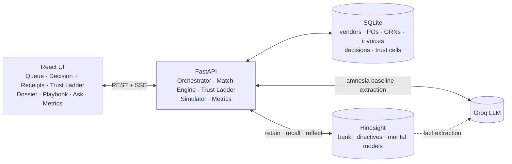

# 🧾 Munshi: The AP Clerk Who Never Forgets

> An Accounts Payable agent that learns your finance team's unwritten rules from every decision, earns autonomy one vendor at a time, and shows its receipts for every call it makes.

**Built for HackwithHyderabad 3.0 · AI Agents That Learn Using [Hindsight](https://hindsight.vectorize.io)**

<!-- TODO: replace with demo GIF once recorded -->
<!--  -->

[Demo video](#) · [Architecture plan](ARCHITECTURE_PLAN.md) · [Resources & prior art](RESOURCES.md)

---

## The problem

A mid-size Indian manufacturer processes about 2,500 vendor invoices a month. 10–25% of them fail the 3-way match (Purchase Order ↔ Goods Receipt ↔ Invoice) and land in an **exception queue**.

Most of those exceptions are *recurring patterns* that a senior clerk resolves in seconds, from memory:

- *"Deccan Steel's price floats with the steel index. Under 3% over PO is fine."*
- *"Sri Lakshmi Packaging always adds ₹1,200 freight. It's in our 2024 agreement."*
- *"Nimbus Cloud re-sends invoices when we're late. That's a duplicate, reject it."*
- *"Apex Logistics has never changed its bank account. If someone says they have, it's fraud."*

That knowledge lives in **people, not systems**. When the senior clerk goes on leave, the queue piles up. MSME vendors must be paid within 45 days (Income-tax Act §43B(h)), so a stuck queue costs real tax money. When the clerk leaves the company, the knowledge leaves with them.

## The solution

**Munshi** (Hindustani for the clerk who kept the merchant's books) triages every exception invoice:

1. **Detects** the exception deterministically: price variance, quantity mismatch, un-PO'd charge, duplicate, GSTIN mismatch, tax error, bank-detail change, or missing PO.
2. **Recalls** how similar cases for the same vendor were resolved before, using Hindsight.
3. **Proposes** a decision with a confidence score and cites the exact past decisions it relied on.
4. **Learns** from every human approval, rejection and override, including the *reason* given.

## What makes Munshi different

| | |
|---|---|
| 🎓 **Earned autonomy** | Munshi starts as an **Intern** that only suggests. For each *vendor × exception type* it gets promoted to **Associate** (one-click accept) and then **Senior** (auto-resolves), once its proposals keep matching the humans. One override on a risky case demotes it straight back to Intern. |
| 🧾 **Receipts** | Every recommendation links to the specific past decisions behind it: who decided, when, and why. Auditors can always ask *"why was this paid?"* and get an answer. |
| 🛡️ **Fraud memory** | Munshi remembers what normal looks like for each vendor (bank account, email domain, amounts, cadence), so it catches look-alike-domain bank-change scams that static rules miss. |
| 📖 **A playbook that writes itself** | The team's unwritten rules are consolidated into a living AP Playbook. You can scrub through its version history and watch it grow week by week. |
| 🧠 **Amnesia toggle** | Run the same invoice with memory **off** (a generic LLM) and **on** (Munshi), side by side. The difference is the product. |

---

## How Munshi uses Hindsight

Hindsight is not a bolt-on here. It *is* the agent's institutional memory. Exact data (amounts, POs, receipts) stays in SQLite and plain Python, so money math never goes through an LLM. Everything the team *knows* lives in Hindsight.

| Hindsight feature | How Munshi uses it |
|---|---|
| **Memory bank** + mission + disposition | One bank (`munshi-ap`) with a senior-AP-accountant mission. Disposition: skepticism 5, literalism 4, empathy 2, because AP is adversarial. |
| **Directives** | Hard financial controls no precedent can override: verify bank changes by call-back, never pay duplicates, escalate invoices above ₹5 lakh, always cite evidence. These are also enforced in code (defence in depth). |
| **`retain`** | Every exception, human decision (with reason), agent proposal, override, vendor email and outcome is stored as a natural-language narrative. Each carries `tags` (`vendor:*`, `exc:*`), `metadata`, a business-date `timestamp` and an idempotent `document_id`. |
| **`recall`** | Per exception: tag-scoped, time-anchored retrieval of precedents for this vendor and exception type. |
| **`reflect`** + `response_schema` | Produces a structured decision (`action`, `confidence`, `rationale`, `risk_flags`). `include_facts=True` returns `based_on`, which the UI shows as **receipts**. |
| **Observations** | Hindsight consolidates raw decisions into patterns such as *"Deccan Steel variance under 3% is routinely approved."* |
| **Mental models** | A **Vendor Dossier** per vendor, a global **AP Playbook** and a **Fraud Watchlist**. They auto-refresh after consolidation (`mode: "delta"`), and `get_mental_model_history` powers the playbook timeline. |
| **Bank cloning** (`aclone_bank`) | Reproducible demo snapshots (Week 0 and Week 12), restored in seconds. |
| **Memory Inspector** | A page that reads the bank live: raw memories by type, learned patterns, directives, mental models, entities, and a recall playground. |

📄 **Full feature map, learning loop and bank configuration: [docs/HINDSIGHT.md](docs/HINDSIGHT.md).**

**When the agent learns, and when it acts:** human decisions and overrides are retained. Hindsight consolidates them into observations, which refresh the mental models. The next `reflect` call starts from those models, so its proposals get better. Agreement stats, tracked in SQLite, decide whether that proposal is shown for review or auto-resolved.

---

## Architecture



**The triage pipeline is plain Python orchestration, not a free-form tool-calling loop.** The LLM is used at exactly one point, through a JSON-schema'd `reflect` call. Its output is Pydantic-validated, retried once, and falls back to a safe `HOLD` if it still fails. A code-level guard then forces `HOLD`/`ESCALATE` for bank changes, duplicates and high-value invoices, whatever the LLM said.

Full design, data model, memory schema and risk register: **[ARCHITECTURE_PLAN.md](ARCHITECTURE_PLAN.md)**.

---

## Tech stack

| Layer | Tech |
|---|---|
| Memory | [Hindsight](https://github.com/vectorize-io/hindsight) (Cloud, or local Docker) via `hindsight-client` |
| LLM | [Groq](https://groq.com): `openai/gpt-oss-120b` (agent), `openai/gpt-oss-20b` (inside Hindsight) |
| Backend | Python 3.11 · FastAPI · SQLModel (SQLite) · tenacity · sse-starlette |
| Documents | ReportLab (invoice generation) · pdfplumber (parsing) · Faker `en_IN` |
| Frontend | React 19 + TypeScript · Vite · Tailwind CSS v4 · Recharts · TanStack Query · sonner (toasts) |

---

## Getting started

### Prerequisites
- Python 3.11+ and Node.js 18+
- A **Hindsight Cloud** account ([sign up](https://ui.hindsight.vectorize.io); apply promo code `MEMHACK99` under Billing), **or** Docker Desktop for local Hindsight
- A **Groq** API key ([console.groq.com](https://console.groq.com))

### 1. Configure

```bash
cp .env.example .env
```

Then fill in `.env`:
```ini
HINDSIGHT_URL=https://<your-hindsight-cloud-endpoint>   # or http://localhost:8888
HINDSIGHT_API_KEY=
BANK_ID=munshi-ap
GROQ_API_KEY=
AGENT_MODEL=openai/gpt-oss-120b
AUTO_RESOLVE_MAX_INR=200000
ESCALATE_ABOVE_INR=500000
```

<details>
<summary><b>Optional: run Hindsight locally with Docker</b></summary>

With `GROQ_API_KEY` set in `.env` and `HINDSIGHT_URL=http://localhost:8888`, just run `python scripts/start_hindsight.py`. Or manually:

```bash
docker run -it --pull always --name hindsight --restart unless-stopped --shm-size=1g -p 8888:8888 -p 9999:9999 -e HINDSIGHT_API_LLM_PROVIDER=groq -e HINDSIGHT_API_LLM_API_KEY=$GROQ_API_KEY -e HINDSIGHT_API_LLM_MODEL=openai/gpt-oss-20b -v $HOME/.hindsight-docker:/home/hindsight/.pg0 ghcr.io/vectorize-io/hindsight:latest
```

API: `http://localhost:8888` · Control-plane UI (browse raw memories): `http://localhost:9999`.
On Groq's free tier, add `-e HINDSIGHT_API_LLM_GROQ_SERVICE_TIER=on_demand` if you see `service_tier` errors.
</details>

### 2. Backend

```bash
cd backend
python -m venv .venv
.venv/Scripts/activate                  # macOS/Linux: source .venv/bin/activate
pip install -e ".[dev]"
cd ..
python scripts/generate_data.py         # vendors, POs, GRNs, 143 invoices + PDFs (deterministic, seed=42)
python scripts/setup_bank.py            # Hindsight bank, directives, mental models, 'week0' snapshot + smoke test
python scripts/seed_history.py          # optional, recommended before a demo: replays weeks 1-12 for real
uvicorn app.main:app --app-dir backend --reload --port 8000
```

> **No credentials yet?** Leave `HINDSIGHT_URL` / `GROQ_API_KEY` empty. Munshi runs in *memory-off* mode: the full
> UI and simulator work, proposals fall back to a safe `HOLD`, and memory-only pages explain what's missing.

### 3. Frontend

```bash
cd frontend
npm install
npm run dev                              # http://localhost:5173 (proxies /api to :8000)
```

### Tests

```bash
cd backend
pytest                                   # matching engine, trust ladder, guard, schema, offline end-to-end
```

### 4. Try it
1. Open the **Queue** at Week 0 and click a Deccan Steel price-variance exception. Munshi has no precedent, so it says so.
2. Approve it with a reason: *"Steel index pricing, under 3% is fine."*
3. Click **Simulate next week ▶** a few times. Watch the learning curve and the trust-ladder grid.
4. Open a new Deccan Steel exception. Munshi now auto-resolves it and shows receipts. Flip the **🧠 Memory** toggle to compare.
5. Jump to Week 9 and open the Apex Logistics invoice. 🛡️
6. Open **Playbook** and drag the history slider.

Reset any time from the **Reset** menu (or `POST /api/demo/reset?to=week0` / `?to=week12`). Snapshots are a SQLite backup plus a server-side Hindsight bank clone, so a restore takes seconds and calls no LLM.

---

## Demo data

All data is synthetic but realistic, generated deterministically by `scripts/generate_data.py`:

- **Charminar Foods Pvt Ltd**, a Hyderabad FMCG manufacturer (GSTIN state code 36, Telangana)
- **12 vendors**, each with a hidden "personality" Munshi must learn: index pricing, standing freight agreements, duplicate re-sends, partial MSME deliveries, a new-branch GSTIN, and one **fraud attempt**
- **143 GST-compliant invoice PDFs** over 14 business weeks (CGST/SGST vs IGST by state, HSN codes, valid GSTIN checksums, bank details), of which **65 are exceptions**
- Scripted human decisions, including a few inconsistent ones and a **policy change in week 8**, to show Munshi handling knowledge that changes

---

## Evaluation

`scripts/evaluate.py` runs the held-out weeks 13–14 (11 exception cases with ground-truth actions) with memory **off** vs **on**, using the same LLM.

| Metric | Amnesia (LLM only) | Munshi (Hindsight) |
|---|---|---|
| Decision accuracy | _TBD_ | _TBD_ |
| Auto-resolvable (confidence ≥ 0.85 and correct) | _TBD_ | _TBD_ |
| Fraud / duplicates caught | _TBD_ | _TBD_ |
| Avg latency | _TBD_ | _TBD_ |

<!-- Fill with measured numbers only. -->

---

## Project structure

```text
munshi/
├── backend/app/
│   ├── services/      # ingestion, matching, memory (Hindsight), orchestrator, amnesia,
│   │                  # trust ladder, llm (Groq), simulator, metrics
│   ├── routers/       # invoices, exceptions, trust, vendors, playbook, ask, simulate, metrics
│   └── main.py
├── backend/tests/     # matching, trust ladder, guards, schema fallback
├── frontend/src/pages # Queue, Decision, Trust, Vendor, Playbook, Ask, Metrics
├── data/seed/         # generated vendors, POs, GRNs, invoices, decisions, emails
├── data/snapshots/    # Hindsight bank + SQLite snapshots (week0 / week12)
└── scripts/           # generate_data, setup_bank, seed_history, snapshot, evaluate
```

## Roadmap (path to adoption)

- Connectors for **Tally Prime, Zoho Books, SAP B1, ERPNext**
- Email inbox ingestion (vendor emails as memory)
- MSME 45-day SLA radar with ₹ deduction-at-risk
- OCR for scanned invoices
- Multi-entity / multi-bank tenancy with per-team memory scoping (Hindsight tags)

## Team

| Name | Role |
|---|---|
| _TBD_ | _TBD_ |

## Acknowledgements

- [Vectorize](https://vectorize.io) for Hindsight and the [cookbook](https://github.com/vectorize-io/hindsight-cookbook)
- [Groq](https://groq.com) for fast inference
- HackwithHyderabad 3.0 organisers

## License

MIT
