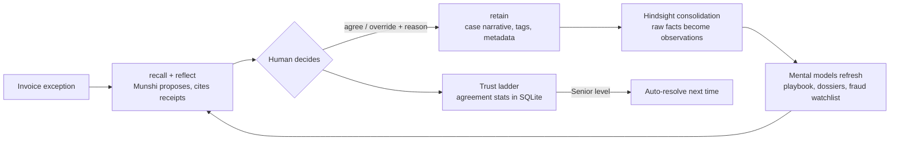

# How Munshi Uses Hindsight

Munshi is an Accounts Payable agent, but **Hindsight is the product**. Exact data (invoices, POs, amounts) lives in SQLite and deterministic Python; everything the AP team *knows* — how exceptions were resolved, why, vendor quirks, policy changes, fraud history — lives in a Hindsight memory bank. Remove Hindsight and Munshi becomes a generic LLM that recommends `HOLD` for everything (you can see this live with the **Memory ON vs OFF** toggle).

## Feature map

| What the user sees | Hindsight feature behind it | Where |
|---|---|---|
| Munshi's recommendation on each invoice | `reflect` with a JSON schema, reasoning over past decisions | [orchestrator.py](../backend/app/services/orchestrator.py) → [memory.py](../backend/app/services/memory.py) |
| 🧾 Receipts (the past decisions it cites) | `recall` with vendor and exception tags, plus `reflect`'s `based_on` evidence | [memory.py](../backend/app/services/memory.py) |
| Learning from each approve or override | `retain`: every decision and reason is stored as a memory | [orchestrator.py](../backend/app/services/orchestrator.py) → `retain_case` |
| Hard rules (bank-change callback, duplicates, ₹5 lakh escalation) | Directives | [memory.py](../backend/app/services/memory.py) → `DIRECTIVES` |
| Skeptical "senior accountant" behaviour | Bank mission and disposition (skepticism 5) | [memory.py](../backend/app/services/memory.py) → `setup_bank` |
| AP Playbook, Fraud Watchlist, vendor dossiers | Mental models that refresh after consolidation, plus version history | Playbook and vendor pages |
| Ask Munshi | `reflect` | `/api/ask` |
| Demo reset in seconds | Bank cloning (`aclone_bank`) | [snapshots.py](../backend/app/services/snapshots.py) |
| Memory ON vs OFF comparison | The same case run with and without Hindsight | Case page |
| **Memory Inspector** — raw memories, learned patterns, directives, entities, recall playground | `list_memories`, bank stats and profile, `list_directives`, `list_mental_models`, entities, raw `recall` | Memory inspector page → [insights.py](../backend/app/routers/insights.py) |

## The learning loop



1. **Retain.** Every resolved case is stored as a natural-language narrative (what was wrong, what Munshi proposed, what the human decided, and *why*), tagged `vendor:<id>`, `exc:<type>`, `decision` / `correction` / `risk`, with the business date as its timestamp and `case-<invoice>` as an idempotent `document_id`.
2. **Consolidate.** Hindsight turns repeated decisions into observations such as *"Deccan Steel price variance under 3% is approved because of index pricing"*, and tracks when a pattern changes (the week-8 policy change lowers it to 2%).
3. **Refresh.** Mental models (`mode: "delta"`, `refresh_after_consolidation: true`) rewrite only what changed, so the AP Playbook grows version by version — the playbook page's slider walks through `get_mental_model_history`.
4. **Reason.** The next exception triggers `recall` (tag-scoped, time-anchored — shown as receipts) and `reflect` with a `response_schema`. Reflect reads mental models first, then observations, then raw facts, bounded by directives and the bank's disposition.

## Bank configuration

| Setting | Value | Why |
|---|---|---|
| Mission | Institutional memory of the Charminar Foods AP desk; precedent first, latest policy wins, never put money at risk | Shapes every `reflect` |
| Disposition | skepticism 5 · literalism 4 · empathy 2 | AP is adversarial (fraud, overbilling); contracts and amounts are literal |
| Retain mission | Extract vendors, exception types, amounts, decisions, reasons, deciders, agreements, policy changes, bank/email details | Steers fact extraction toward what AP needs |
| Directives | bank-change verification (100) · duplicate block (90) · high-value escalation (80) · cite evidence (50) | Hard rules no precedent can override — also enforced in code |
| Mental models | AP Playbook · Fraud Watchlist · one Vendor Dossier per vendor (tag-scoped) | Curated, self-refreshing knowledge |

## Running Hindsight locally (Docker)

Easiest: put your Groq key in `.env`, then run `python scripts/start_hindsight.py` (reads the key from `.env`, starts the container, waits until healthy). The equivalent manual command:

```bash
docker run -d --name hindsight --restart unless-stopped --shm-size=1g -p 8888:8888 -p 9999:9999 -e HINDSIGHT_API_LLM_PROVIDER=groq -e HINDSIGHT_API_LLM_API_KEY=<your-groq-key> -e HINDSIGHT_API_LLM_MODEL=openai/gpt-oss-20b -e HINDSIGHT_API_LLM_GROQ_SERVICE_TIER=on_demand -v hindsight-data:/home/hindsight/.pg0 ghcr.io/vectorize-io/hindsight:latest
```

- API: `http://localhost:8888` (set `HINDSIGHT_URL=http://localhost:8888` in `.env`)
- Hindsight's own control-plane UI: `http://localhost:9999`
- Munshi's **Memory Inspector** shows the same bank from the AP team's point of view.

Then: `python scripts/setup_bank.py` → `python scripts/seed_history.py` → `python scripts/evaluate.py`.
